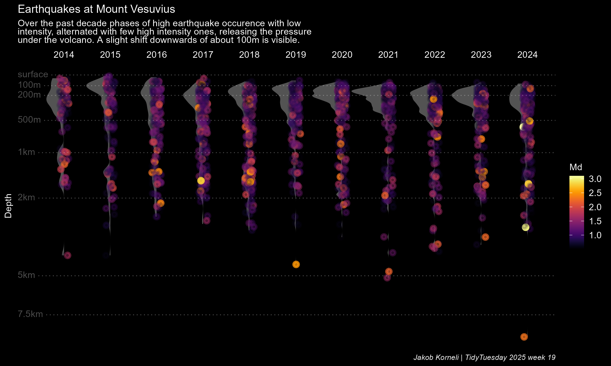
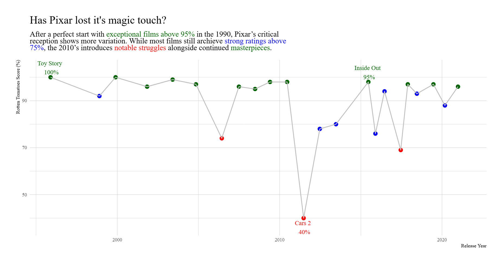

# TidyTuesday

## My work on #TidyTuesday data.

------------------------------------------------------------------------

Figure for the TidyTuesday 2025 week 19 dataset on earthquakes underneath the Mount Vesuvius volcano.

Figure for the TidyTuesday 2025 week 48 dataset

Figure for the Data of the 22-04-12 Dataset on indoor air pollution.

## 

------------------------------------------------------------------------

I recreated a figure on the Pixar Films dataset of TidyTuesday's Week 2025-03-11 originaly designed and coded by Loui Christopher Lee, see the link below. <https://www.linkedin.com/posts/louiewee_tidytuesday-tidytuesday-dataviz-activity-7345512546428178433-hjzm>

